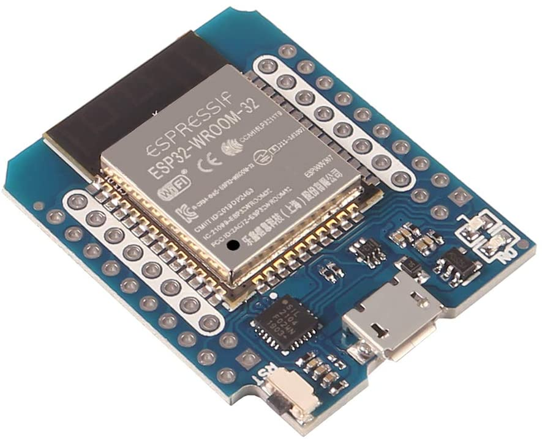
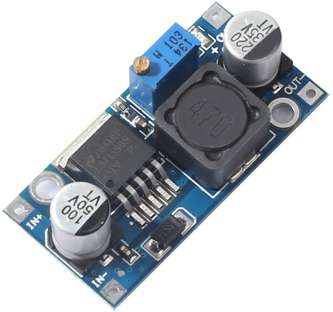
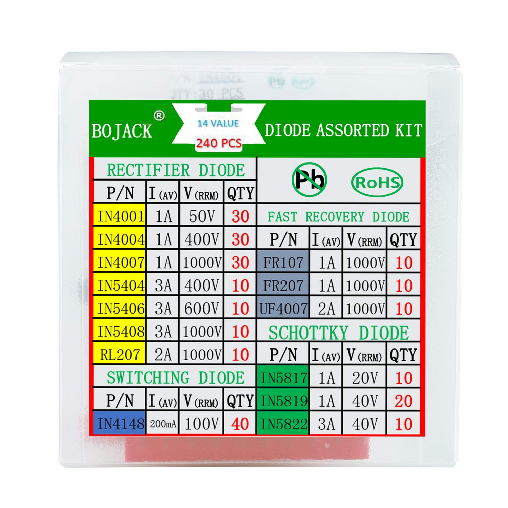
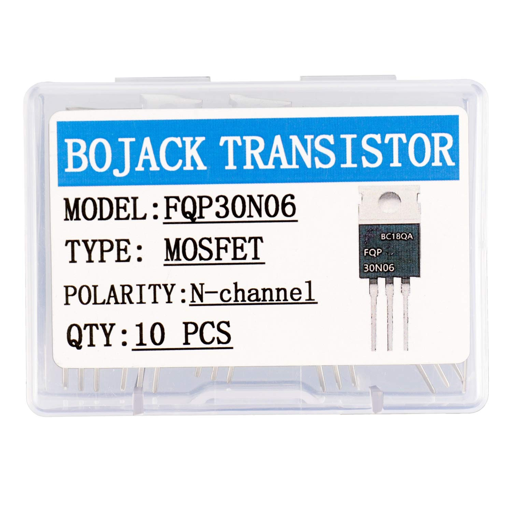
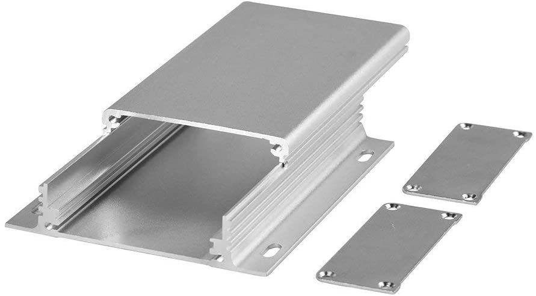
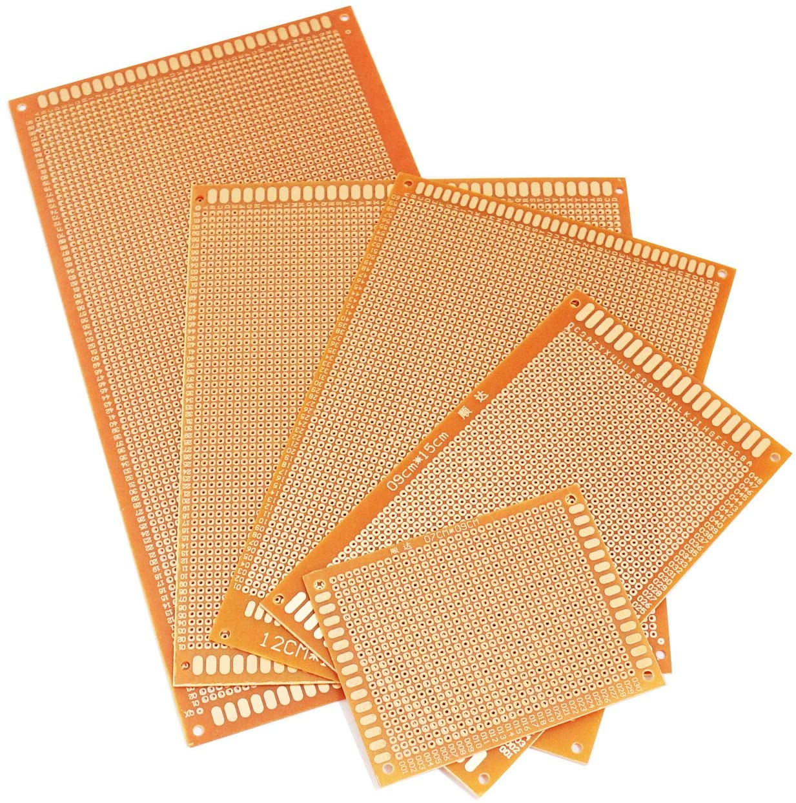
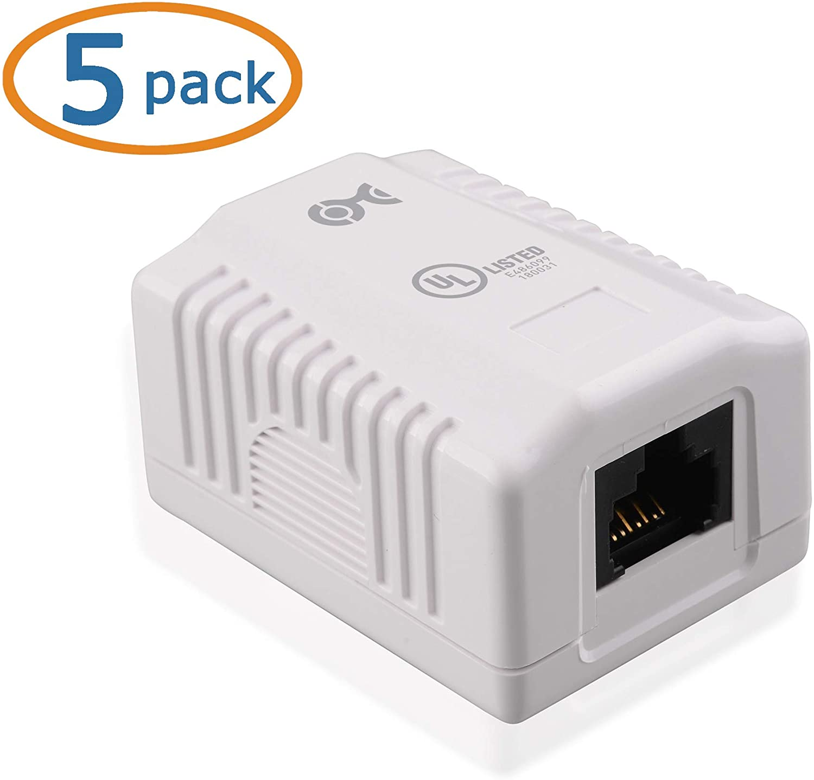
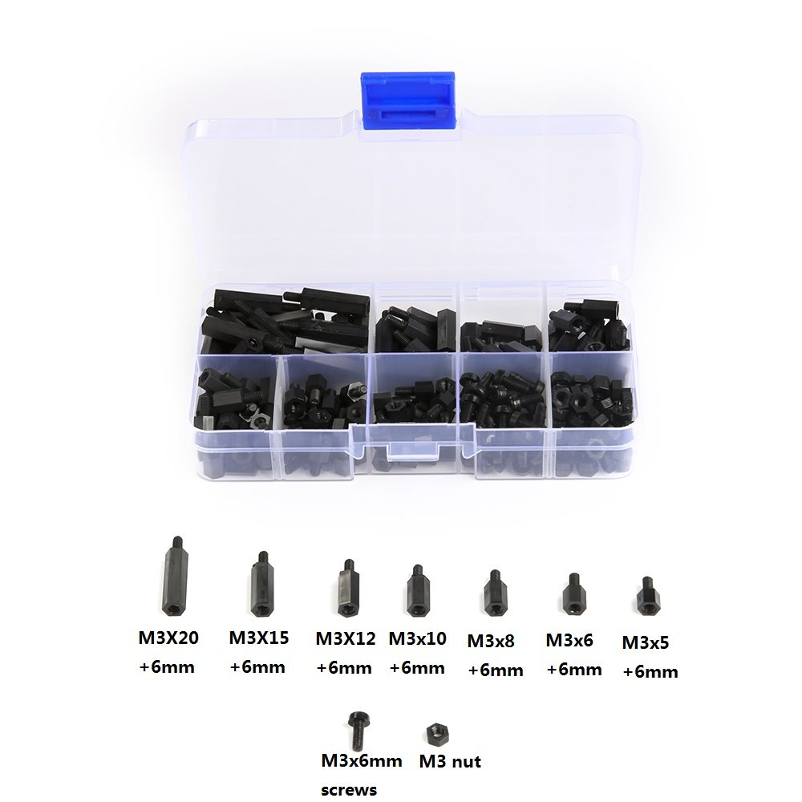

# espCeilingLight
Spike code for my ESP driven ceiling light

## Parts List

### Lighting Module
- (1) ESP32 mini
- (1) LM2596 LM2596S DC-DC Step Down Variable Volt Regulator
- (1) IN4001 Rectifier Diode
- (5) FQP30N06 N-Channel Mosfets
- (5) 1k-ohm Resisters
- (1) Project Box
- (1) PCB Prototype Board (custom cut)
- (1) Set Center Positive Barrel Connectors
- (1) RJ45 Surface Mount Box
- RJ45 cable
- 24 Gage Wire
- Nylon Standoffs

### Power Supply
TODO

### LEDs
TODO

## Parts Breakdown
### Lighting Module
#### ESP32 mini

This is the brains of the project.  We will be using this controller to generate PWM signals for switching the lights, and also to get user input from either capacitive touch or web commands.

#### LM2596 LM2596S DC-DC Step Down Variable Volt Regulator

We need this regulator to provide 5V power to the ESP-32 controller.  We expect the lighting module to take 12V DC power in order to run the 12V LEDs, so this power needs to be stepped down to 5V for the controller.

#### IN4001 Rectifier Diode

This is optional.  Without the diode, powering the ESP-32 through the USB will activate the DC-DC power LED, even when the DC-DC is unpowered from the 12V power source.  This diode will break the voltage field from the ESP-32 to the DC-DC, while allowing voltage from the DC-DC to the ESP-32.  Other diodes will work, but I just chose the IN4001

#### (5) FQP30N06 N-Channel Mosfets

These are the switches to provide 12V PWM signals to the LEDs.  They are triggered by a 3.3V PWM signal from the ESP-32 controller.

#### 1k-ohm Resisters
These are probably optional, but recommended.  When the Mosfets are triggered, they look like a short-circuit for about 30ns.  The resister prevents over-current from the ESP-32 GPIO pins.  The ESP-32 probably has over-current protection, but we probably should not rely on it.

#### Project Box

An aluminum box to contain the lighting module.  Holes are cut where necessary.

#### PCB Prototype Board (custom cut)

This fits into the project box and ties all the components together.

#### Set Center Positive Barrel Connectors
For 12V input power

#### RJ45 Surface Mount Box

We supply the 12V PWM signals from the mosfets to the LEDs through this box.

#### RJ45 cable
To connect the lighting module to the LEDs.

#### Nylon Standoffs

We secure DCDC to the PCB board using non-conductive nylon standoffs.

